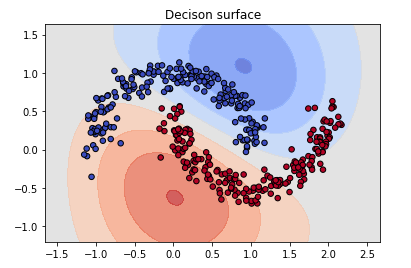
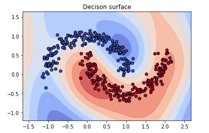

# Semi-Supervised Support Vector Regression (SVR)

## Laplacian Embedded Support Vector Regression (Chen et al., 2012)
The picture below shows the decision surface on Two-Moons data set created by LapESVR when the unlabelled is minimally utilized, $\mu = 1$.  


When $\mu = 1000$, the model learns the structure of the two moons through the unlabelled data.  


## Windows Binary
Currently only Windows binary is supported.

1. Set up VC++ environment variables by running `vcvars64.bat`.
2. To clean the existing binary.
 ```
 nmake -f Makefile.win clean
 ```
3. To build Windows binary.
```
nmake -f Makefile.win lib
```

## Python Interface
Currently only Python interface is supported.

Example is given in `python/LapESVR.ipynb`.

## References
Chen, L., Tsang, I. W., & Xu, D. (2012). Laplacian embedded regression for scalable manifold regularization. IEEE Transactions on Neural Networks and Learning Systems, 23(6), 902–915. https://doi.org/10.1109/TNNLS.2012.2190420
